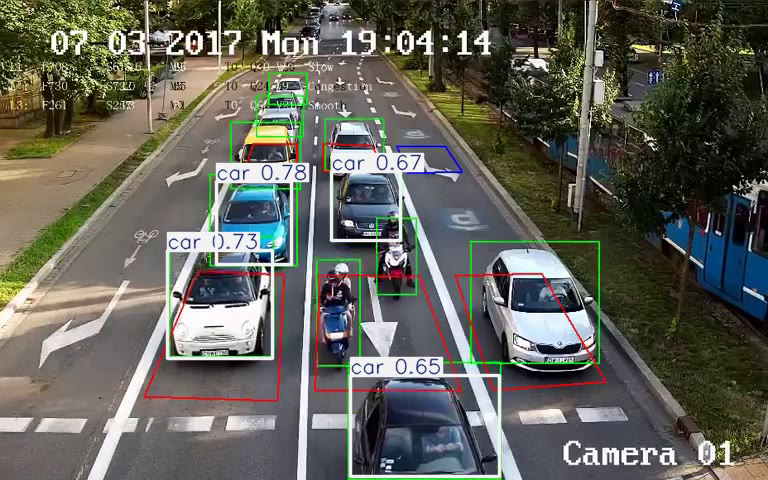
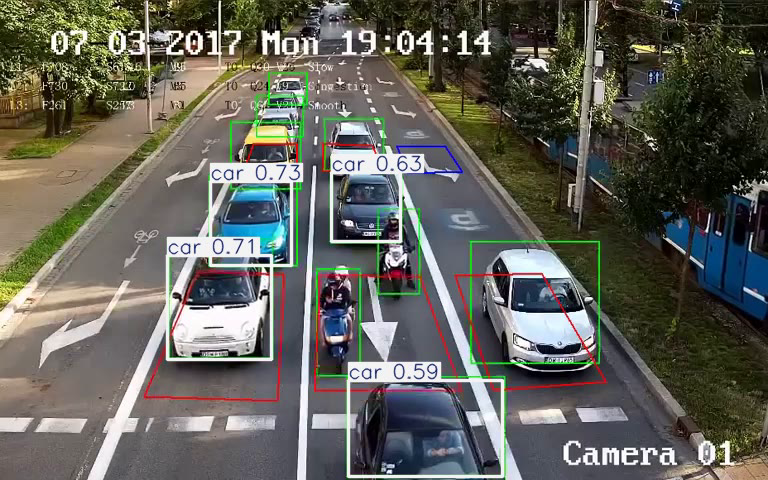
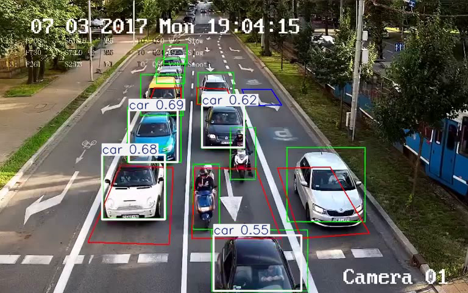
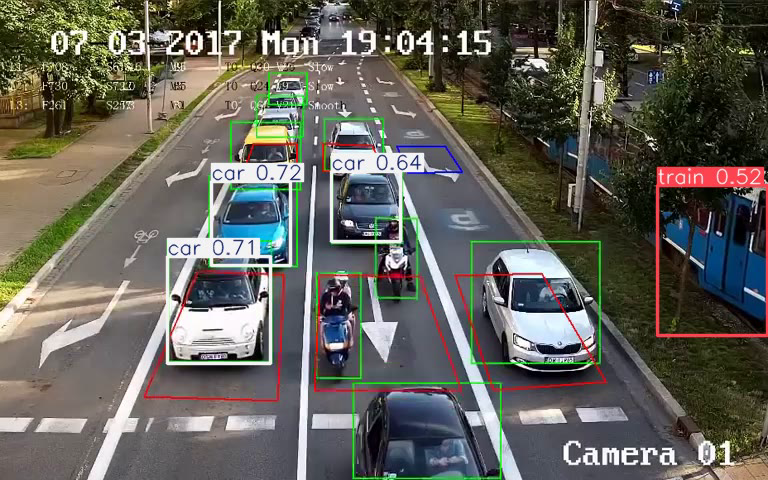

# Deteksi Objek pada Video Menggunakan YOLOv8

Proyek ini adalah implementasi sederhana dari model YOLOv8 untuk melakukan deteksi objek pada file video. Skrip ini dirancang untuk dijalankan di lingkungan Google Colaboratory.


##  Deskripsi

Skrip ini memungkinkan pengguna untuk mengunggah file video, kemudian model YOLOv8n akan memproses video tersebut untuk mendeteksi objek-objek umum seperti orang, mobil, dan lain-lain. Hasilnya adalah video baru dengan kotak pembatas (bounding box) dan label pada objek yang terdeteksi, yang kemudian ditampilkan frame per frame di output Colab.

## Fitur

- Menggunakan model YOLOv8n yang cepat dan efisien.
- Proses unggah video yang mudah melalui antarmuka Colab.
- Menampilkan hasil deteksi secara langsung di notebook.

## Lingkungan & Dependensi

⚠️ **Penting**: Skrip ini dibuat khusus untuk **Google Colaboratory** dan memerlukan **GPU** untuk performa terbaik.

Dependensi utama yang dibutuhkan adalah:
- `ultralytics`
- `opencv-python-headless`

Untuk menginstal semua dependensi, jalankan perintah berikut:
```bash
pip install -r requirements.txt
```

## Cara Menggunakan

1.  **Buka di Google Colab**: Buka file `yolo.py` atau salin kodenya ke dalam notebook Google Colab yang baru.
2.  **Atur Runtime**: Pastikan Anda telah mengatur _hardware accelerator_ ke **GPU** (`Runtime > Change runtime type > GPU`).
3.  **Jalankan Kode**: Jalankan sel kode dari atas ke bawah.
4.  **Unggah Video**: Saat diminta, unggah file video yang ingin Anda analisis.
5.  **Lihat Hasil**: Tunggu proses deteksi selesai. Video hasil akan ditampilkan secara otomatis di sel output.

## Contoh Output

Berikut adalah contoh frame dari video hasil deteksi:

*
*
*
*